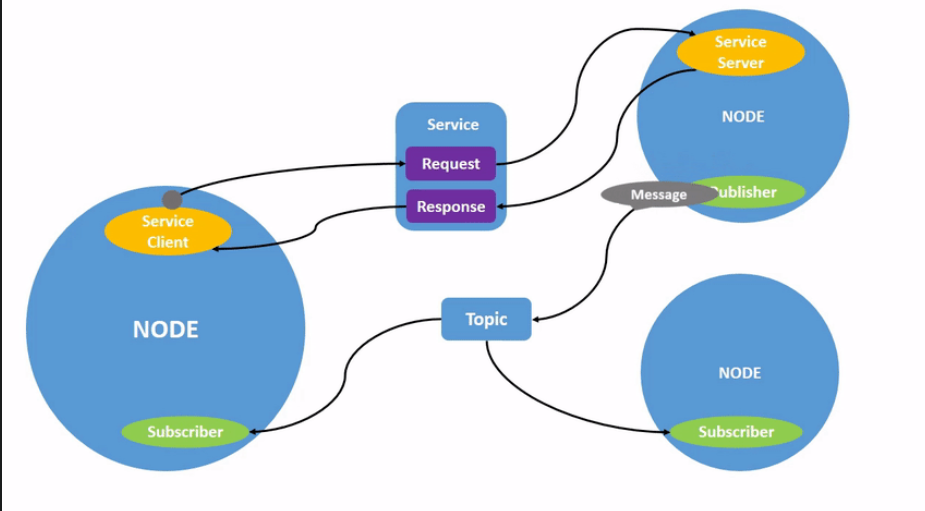

# Tutorial 1: Introduction to ROS2

#### Development of Intelligent Systems, FRI, 2025/2026

The focus of the first tutorial is to get familiar with the basics of the [ROS 2](http://www.ros.org) framework. You will learn to write your own programs within the system, how to execute it properly and communicate with other programs. This tutorial will introduce several important concepts that are crucial for further tutorials, so it is recommended that you refresh the topics after the end of the formal laboratory time at home. After you explore the tutorial, you will need to submit two files as **Homework 1** on a link that will become available on Učilnica. The detailed instructions for the homework are at the end of this README.

## Setting up

To set up ROS 2 on your system, read the [official documentation](https://docs.ros.org/en/jazzy/index.html). In this course, we will be using release **Jazzy** Jalisco, which is a 4 year LTS release.

The recommended operating systems are Ubuntu/Kubuntu/Lubuntu/etc. **24.04 LTS** [that support a Tier 1 native installation](https://www.ros.org/reps/rep-2000.html). Dual booting is generally the most hassle-free method if you have the option. We strongly recommend you to use one of the mentioned operating systems. At worst, at-least one of the team members should have it installed natively.

It's also possible to get ROS 2 installed on Windows in several ways:
- as a [pixi install](https://docs.ros.org/en/jazzy/Installation/Windows-Install-Binary.html#)
- by installing [WSL](https://apps.microsoft.com/detail/9P9TQF7MRM4R?hl=en-us&gl=US) and [Ubuntu 24.04](https://apps.microsoft.com/detail/9nz3klhxdjp5?hl=en-US&gl=US) from the Microsoft store
- via [VMWare/Virtualbox Ubuntu 24.04 image](https://www.osboxes.org/ubuntu/)

Note that it is likely that only the native install will be capable of running the Gazebo simulator with GPU acceleration, which is a requirement for real-time simulation. Please note that we might not be able to help you with issues you encounter with a Windows installation of ROS2.

Example code will be available for download as one [metapackage](https://docs.ros.org/en/jazzy/How-To-Guides/Using-Variants.html) (package that only contains other subpackages) per tutorial.

## Concepts and terminology

ROS 2 is a complex distributed system that introduces a few concepts that are good to know under their established expressions:

- [Basic concepts](https://docs.ros.org/en/jazzy/Concepts/Basic.html): nodes, topics, parameters, launch files, cli tools
- [Intermediate concepts](https://docs.ros.org/en/jazzy/Concepts/Intermediate.html): coordinate frames, actions and tasks, message ontology
- [Advanced concepts](https://docs.ros.org/en/jazzy/Concepts/Advanced.html): build system, internal interfaces

More info on the most important concepts:

- [Nodes](https://docs.ros.org/en/jazzy/Tutorials/Beginner-CLI-Tools/Understanding-ROS2-Nodes/Understanding-ROS2-Nodes.html)
	- Nodes are standalone programs that perform some function, such as reading from a sensor or processing some data. They communicate with other nodes via topics. Nodes can subscribe to different topics, listen for data or events and react accordingly. They can also set up new topics to which they publish results.

- [Topics](https://docs.ros.org/en/jazzy/Tutorials/Beginner-CLI-Tools/Understanding-ROS2-Topics/Understanding-ROS2-Topics.html)
	- Topics are data channels for communication between nodes. Each topic has a data type that defines the format of the data published to it. Nodes can subscribe to topics and receive data when it is published using a callback function.

- [Services](https://docs.ros.org/en/jazzy/Tutorials/Beginner-CLI-Tools/Understanding-ROS2-Services/Understanding-ROS2-Services.html)
	- Services are an on-demand method of node communication. A node can create a service that waits for requests and returns the response. The type of request and response message types is defined in a `.srv` file.

- [Actions](https://docs.ros.org/en/jazzy/Tutorials/Beginner-CLI-Tools/Understanding-ROS2-Actions/Understanding-ROS2-Actions.html)
	- Actions are used for more complex long-running tasks, such as navigation. The client sets a goal, and the action server provides feedback during the execution and notifies of the goal being reached. During execution, the action can also be cancelled if needed.

## Exploring ROS 2

Install the turtlesim package, if it's not already installed:

`sudo apt update && sudo apt install ros-dev-tools`

`sudo apt upgrade`

`sudo apt install ros-jazzy-turtlesim`

All binary ROS packages are all typically available on apt following the ros-<ros_version_name>-<package_name> convention.

`sudo apt install terminator -y`

`echo "source /opt/ros/jazzy/setup.bash" >> ~/.bashrc`

`source ~/.bashrc`

Open a new terminal window and run the command:

`ros2 run turtlesim turtlesim_node`

The `ros2 run` command is the simplest way of running nodes. With the previous command we started the turtlesim_node which is located in the turtlesim package. In a third terminal, run the command:
`ros2 run turtlesim turtle_teleop_key`
This will allow you to control the turtle using the keyboard. Note that the terminal running the teleop requires the focus for the teleop to work.

Using the teleop node, messages are being sent to the turtlesim node. Open yet another terminal window and try to find out what's going on in the ROS system with the following commands:

- `ros2 topic`
- `ros2 interface`
- `ros2 service`
- `ros2 param`
- `ros2 doctor --report`
- `ros2 run rqt_graph rqt_graph`

Note that by typing −h or −help after the command verb will print information about the usage of these commands.

Run the node dis_tutorial1/draw_square.py, and observe its effect on the turtle. Print out and analyze the messages being sent to the turtle. Which node is responsible for the turtle movement and what is the structure of the messages?

In one terminal inside `~/rins` run: `ros2 run turtlesim turtlesim_node` and in another run `ros2 run dis_tutorial1 py_draw_square.py`.

Answer the following questions:

- Which **nodes** are currently active? In third terminal run `ros2 node list`:
```
/draw_square
/turtlesim
```
- What **topics** are currently active? In third terminal run `ros2 topic list`:
```
/parameter_events
/rosout
/turtle1/cmd_vel
/turtle1/color_sensor
/turtle1/pose
```
- What is the **message type** for each topic? In third terminal run `ros2 topic list -t`:
```
/parameter_events [rcl_interfaces/msg/ParameterEvent]
/rosout [rcl_interfaces/msg/Log]
/turtle1/cmd_vel [geometry_msgs/msg/Twist]
/turtle1/color_sensor [turtlesim/msg/Color]
/turtle1/pose [turtlesim/msg/Pose]
```
- To which topics is each node **publishing**? In third terminal we run `ros2 node info /draw_square`:
```
/draw_square
  Subscribers:
    /turtle1/pose: turtlesim/msg/Pose
  Publishers:
    /parameter_events: rcl_interfaces/msg/ParameterEvent
    /rosout: rcl_interfaces/msg/Log
    /turtle1/cmd_vel: geometry_msgs/msg/Twist
  Service Servers:
    /draw_square/describe_parameters: rcl_interfaces/srv/DescribeParameters
    /draw_square/get_parameter_types: rcl_interfaces/srv/GetParameterTypes
    /draw_square/get_parameters: rcl_interfaces/srv/GetParameters
    /draw_square/get_type_description: type_description_interfaces/srv/GetTypeDescription
    /draw_square/list_parameters: rcl_interfaces/srv/ListParameters
    /draw_square/set_parameters: rcl_interfaces/srv/SetParameters
    /draw_square/set_parameters_atomically: rcl_interfaces/srv/SetParametersAtomically
  Service Clients:
    /reset: std_srvs/srv/Empty
  Action Servers:

  Action Clients:

```
We see that `/draw_square` is publishing to the topics `/parameter_events`, `/rosout`, `/turtle1/cmd_vel`.
In third terminal we run `ros2 node info /turtlesim`:
```
/turtlesim
  Subscribers:
    /parameter_events: rcl_interfaces/msg/ParameterEvent
    /turtle1/cmd_vel: geometry_msgs/msg/Twist
  Publishers:
    /parameter_events: rcl_interfaces/msg/ParameterEvent
    /rosout: rcl_interfaces/msg/Log
    /turtle1/color_sensor: turtlesim/msg/Color
    /turtle1/pose: turtlesim/msg/Pose
  Service Servers:
    /clear: std_srvs/srv/Empty
    /kill: turtlesim/srv/Kill
    /reset: std_srvs/srv/Empty
    /spawn: turtlesim/srv/Spawn
    /turtle1/set_pen: turtlesim/srv/SetPen
    /turtle1/teleport_absolute: turtlesim/srv/TeleportAbsolute
    /turtle1/teleport_relative: turtlesim/srv/TeleportRelative
    /turtlesim/describe_parameters: rcl_interfaces/srv/DescribeParameters
    /turtlesim/get_parameter_types: rcl_interfaces/srv/GetParameterTypes
    /turtlesim/get_parameters: rcl_interfaces/srv/GetParameters
    /turtlesim/get_type_description: type_description_interfaces/srv/GetTypeDescription
    /turtlesim/list_parameters: rcl_interfaces/srv/ListParameters
    /turtlesim/set_parameters: rcl_interfaces/srv/SetParameters
    /turtlesim/set_parameters_atomically: rcl_interfaces/srv/SetParametersAtomically
  Service Clients:

  Action Servers:
    /turtle1/rotate_absolute: turtlesim/action/RotateAbsolute
  Action Clients:

```
We see that `/turtlesim` is publishing to the topics `/parameter_events`, `/rosout`, `/turtle1/color_sensor`, `/turtle1/pose`.

- To which topics is each node **subscribed**? Node `/draw_square` is subscribed to topic `/turtle1/pose` and node `/turtlesim` is subscribed to topics `/parameter_events` and `/turtle1/cmd_vel`.

- What are the packages that define different **message types**? Run `ros2 interface list` to get all active interfaces (message types under Messages), or `ros2 interface list | grep msg`. Then for message type (e.g. 'Twist') run: `ros2 interface list | grep Twist`:
```
    geometry_msgs/msg/Twist
    geometry_msgs/msg/TwistStamped
    geometry_msgs/msg/TwistWithCovariance
    geometry_msgs/msg/TwistWithCovarianceStamped
```
Here first part is package ('geometry_msgs'). We can also see message structure via: `ros2 interface show geometry_msgs/msg/Twist`:
```
# This expresses velocity in free space broken into its linear and angular parts.

Vector3  linear
	float64 x
	float64 y
	float64 z
Vector3  angular
	float64 x
	float64 y
	float64 z
```
To see message type of a topic `/turtle1/cmd_vel` run: `ros2 topic info /turtle1/cmd_vel`:
```
Type: geometry_msgs/msg/Twist
Publisher count: 1
Subscription count: 1
```

- Which **parameters** can be set on which nodes? To see all parameters for one specific node (e.g. /my_node), run `ros2 param list /my_node` (or without `/my_node` to see for all active nodes):
```
  start_type_description_service
  use_sim_time
```
Or more in detail run `ros2 param describe /draw_square start_type_description_service`:
```
Parameter name: start_type_description_service
  Type: boolean
  Description: If enabled, start the ~/get_type_description service.
  Constraints:
    Read only: true
```

Additionally, try to:
- Get a **visualization** of all the nodes and topics in the system. Install rqt graph and run `ros2 run rqt_graph rqt_graph`.
- Get a printout of all the **packages** installed in the system. Run `ros2 pkg list`.
- Get a printout of all the **messages** installed in the system. Run `ros2 interface list`.
- **Print** out the messages being published on each topic. Run `ros2 topic echo <topic_name>`.
- **Publish** a message on each topic. Run `ros2 topic pub <topic_name> <msg_type> '<args>'`.
- **Set** the background color of turtlesim to a color of your choice. Run:
```
ros2 param set /turtlesim background_r 255
ros2 param set /turtlesim background_g 0
ros2 param set /turtlesim background_b 0
ros2 service call /clear std_srvs/srv/Empty
```

Explore the usage of other commands that are found in the [ROS 2 Cheatsheet](https://www.theconstructsim.com/wp-content/uploads/2021/10/ROS2-Command-Cheat-Sheets-updated.pdf). You can also find the full turtlesim documentation [here](https://docs.ros.org/en/jazzy/Tutorials/Beginner-CLI-Tools/Introducing-Turtlesim/Introducing-Turtlesim.html#prerequisites).

## Writing a package

Write a package that contains a simple program that you can run using the `ros2 run` command and outputs a string (e.g. "Hello from ROS!") to the terminal every second.

Use the following tutorials as a starting point (from [Creating a package](https://docs.ros.org/en/jazzy/Tutorials/Beginner-Client-Libraries/Creating-Your-First-ROS2-Package.html)):

- package is organizational unit for ROS2 code (for installation and sharing)
- package creation using ament as build system and colcon as build tool (CMake or Python)
- ROS2 Python package minimum/base content:
  - `package.xml` file that contains meta information about the package
  - `resource/<package_name>` marker file for the package
  - `setup.cfg` required only when package has executables, so `ros2 run` can find them
  - `setup.py` contains instructions for how to install the package
  - `<package_name>` is a directory used by ROS2 tools to find the package (contains `__init__.py`)
  - therefore base file structure:
  ```
  my_package/
      package.xml
      resource/my_package
      setup.cfg
      setup.py
      my_package/
  ```
- best practice to have src folder within workspace (`~/rins/src`) where we create our packages
- package creation: 
  - `cd ~/rins/src`, 
  - `ros2 pkg create --build-type ament_python --license Apache-2.0 --node-name my_node my_package` (specify `--node-name` so that ROS2 generates also template source file `my_node.py` and adds executable entry points to build files; to delete package, just delete its folder: `rm -rf <your_package_name>`, also do this: `rm -rf build/ install/ log/`, which then requires `colcon build` again to rebuild other packages again)
- package build and sourcing the setup file:
  - `cd ~/rins` (to build all the packages within the `src` subdirectory and create setup files in the `install` subdirectory),
  - `colcon build` (or to only build the selected packages: `colcon build --packages-select my_package`)
  - `source install/setup.bash` or better add this line to `~/.bashrc` (this command is to make the newly built packages visible to ROS2 - added to path)
- use package (run nodes):
  - `ros2 run my_package my_node`
- examine package contents:
  - `cd ~/rins/src/my_package`
  - `ls`
  - inside the `my_package` is `my_node.py`, also other custom Python nodes will go there
- customize meta information inside `~/rins/src/my_package/package.xml`
  - the `<..._depend>` tags are where dependencies on other packages will be listed for colcon to search them
  - also set the description, maintainer and license fields in file `setup.py`

Now we can add two more nodes, one that sends a message and another one that retrieves it and prints it to the terminal (see [Simple publisher and subscriber in Python](https://docs.ros.org/en/jazzy/Tutorials/Beginner-Client-Libraries/Writing-A-Simple-Py-Publisher-And-Subscriber.html) or [Simple publisher and subscriber in C++](https://docs.ros.org/en/jazzy/Tutorials/Beginner-Client-Libraries/Writing-A-Simple-Cpp-Publisher-And-Subscriber.html)):
- `cd ~/rins/src`
- create package for publisher node: `ros2 pkg create --build-type ament_python --license Apache-2.0 py_pubsub`
- `cd ~/rins/src/py_pubsub/py_pubsub`
- run `wget https://raw.githubusercontent.com/ros2/examples/jazzy/rclpy/topics/minimal_publisher/examples_rclpy_minimal_publisher/publisher_member_function.py` to get example code into `publisher_member_function.py` file
- examine the code (imports/dependencies rclpy to get Node class and message type String, MinimalPublisher class that inherits from Node, in constructor we create_publisher(msg_type, 'topic_name', queue_size) and create_timer(timer_period, timer_callback), the timer callback creates a message and publishes it (.publish(msg)), in main function we initialize rclpy library, create MinimalPublisher node, spin it so that callbacks are called, at the end destroy node and shutdown rclpy)
- add dependencies:
  - `cd ~/rins/src/py_pubsub`
  - open `package.xml` and fill in the `<description>`, `<maintainer>` and `<license>` tags and add `<exec_depend>rclpy</exec_depend>`, `<exec_depend>std_msgs</exec_depend>`
  - open `setup.py` and match the maintainer, maintainer_email, description and license fields to your package.xml and add the following line within the console_scripts brackets of the entry_points field: `entry_points={
        'console_scripts': [
                'talker = py_pubsub.publisher_member_function:main',
        ],
},`
- now create subscriber node:
  - `cd ~/rins/src/py_pubsub/py_pubsub`
  - `wget https://raw.githubusercontent.com/ros2/examples/jazzy/rclpy/topics/minimal_subscriber/examples_rclpy_minimal_subscriber/subscriber_member_function.py`
  - examine the code (..., MinimalSubscriber class has create_subscription(msg_type, 'topic name', listener_callback, queue_size), the listener_callback that prints message)
  - same `package.xml` and `setup.cfg`
  - in `setup.py` add entry point: `entry_points={
        'console_scripts': [
                'talker = py_pubsub.publisher_member_function:main',
                'listener = py_pubsub.subscriber_member_function:main',
        ],
},`
- build and run:
  - check for missing deps: `cd ~/rins`, `rosdep install -i --from-path src --rosdistro jazzy -y`
  - build new package: `cd ~/rins` and `colcon build --packages-select py_pubsub`
  - source setup files `source install/setup.bash`
  - run talker node: `ros2 run py_pubsub talker` and in another terminal run listener node: `ros2 run py_pubsub listener`


## Services

In the tutorial you have examples of creating a service and a client as well as defining a custom service interface. We define a custom service by specifying the structure of the request that the service will accept and the response that it will return. 

Use the following tutorials as a starting point (from [Simple publisher and subscriber in Python](https://docs.ros.org/en/jazzy/Tutorials/Beginner-Client-Libraries/Writing-A-Simple-Py-Service-And-Client.html) or [Simple service and client in C++](https://docs.ros.org/en/jazzy/Tutorials/Beginner-Client-Libraries/Writing-A-Simple-Cpp-Service-And-Client.html)):

- `cd ~/rins/src`
- `ros2 pkg create --build-type ament_python --license Apache-2.0 py_srvcli --dependencies rclpy example_interfaces` (here `--dependencies` will automatically add the necessary dependency lines to `package.xml`)
- add service node file `service_member_function.py` inside `~/rins/src/py_srvcli/py_srvcli` and add entry point for it into `~/rins/src/py_srvcli/setup.py`:
```
'service = py_srvcli.service_member_function:main',
```
- add client node file `client_member_function.py` inside `~/rins/src/py_srvcli/py_srvcli` and add entry point for it into `~/rins/src/py_srvcli/setup.py`:
```
entry_points={
    'console_scripts': [
        'service = py_srvcli.service_member_function:main',
        'client = py_srvcli.client_member_function:main',
    ],
},
```
- build and run:
  - `cd ~/rins`
  - `rosdep install -i --from-path src --rosdistro jazzy -y`
  - `colcon build --packages-select py_srvcli`
  - `source install/setup.bash`
  - run service node: `ros2 run py_srvcli service`
  - run client node: `ros2 run py_srvcli client 2 3`
  

See the [interfaces doc](https://docs.ros.org/en/jazzy/Concepts/Basic/About-Interfaces.html) for a reference of all the possible native data types. The `ros2 interfaces list` command shows all built messages, services, and actions, which are themselves types that can be used in custom interfaces.

Note that only `ament_cmake` packages are capable of building interfaces (i.e. services and messages), so if you have an `ament_python` package you'll need a separate one for message definitions.

------

### 🗎 Tips and tricks

For more useful code snippets, check out the [ROS 2 Cookbook](https://github.com/mikeferguson/ros2_cookbook).

Since running several different nodes in parallel requires multiple terminals, we recommend you to use a terminal emulator that is able to display several terminals in a single window. A good choice is [Terminator](https://gnome-terminator.org/). You can install it with `sudo apt install terminator`. It should also be preinstalled on the classroom computers. You can split the screen horizontally or verically with the shortcuts `ctrl + shift + e` and `ctrl + shift + o`, respectively.

In order for your packages to be visible to ROS2, you will need to run `source install/setup.bash` in your workspace directory after build. As this holds for all terminals, a good idea is to add the following to your `.bashrc` file: `source /home/<user>/ros2_workspace/install/local_setup.bash`

Running `colcon build` is necessary after any source code changes, but only for C++ nodes (or messages/services). If writing python nodes, and you build the package using the flag `--symlink-install`, the links to your python source files were created and changing your code should work without building the package again. If you run into any build errors that don't make any sense, try deleting the `build`, `log` and `install` directories and run the build again.

Here are some other useful colcon parameters:
- `--cmake-args=-DCMAKE_BUILD_TYPE=Release` (disable debugging, enable compile time optimization)
- `--executor sequential` (use single threaded compilation, takes longer but uses less memory which can be useful when compiling large projects on limited hardware)

When in doubt, reset the cache server: `ros2 daemon stop; ros2 daemon start`

Occasionally, it can be easier to debug new topics and services by publishing or calling straight from the command line, instead of from a node. Following are some commands that can help you with this:
```
# send message from terminal
ros2 topic pub <topic name> <message type> <data> -r <publishing rate>

# e.g.:
ros2 topic pub /chat std_msgs/String "data: test" -r 1


# find interface for service
ros2 interface show <service interface name>

e.g.:
ros2 interface show dis_tutorial1/srv/AddTwoInts


# call service from terminal
ros2 service call <service name> <service interface> <data in yaml format>

# e.g.: (note that spaces in data field are important)
ros2 service call add_two_ints dis_tutorial1/srv/AddTwoInts "{a: 1, b: 2}"
```

# Homework 1

## Part 1

Open the file `homework1_answers.txt` from this repository, follow the instructions and include your answers to the questions in the marked slots in the same file. Then, upload the file on the available link on Učilnica.

## Part 2

After you have installed and tested ROS2, as well as set up your own workspace you should:

- Create a new package. In the package you can use C++ or Python.
  - `cd ~/rins/src`
  - `ros2 pkg create --build-type ament_cmake my_package_hw` (notice we are using ament_cmake, because we are putting messages and python node into same place and it generates code for messages, services, actions (uses CMakeLists.txt))

| feature | ament_cmake | ament_python |
|----------|----------|----------|
| primary file | CMakeLists.txt | setup.py |
| language | c++, py | py only |
| interface support | yes (msg, srv, action) | no |
| complexity | higher | lower |
| performance | can be optimized for c++ | python speed |
| use case | custom messages, c++/py nodes, mixed packages | pure python logic/nodes |

- We have two basic types of communication:
  - via message (publisher -> subscriber)
  - via service (service server <-> service client)

- Create a custom message type, that has a string fields, an integer field, and a bool field.
  - `cd ~/rins/src/my_package_hw`
  - `mkdir msg`
  - `cd msg`
  - `nano MyCustomMessage.msg`:
  ```
  string title
  string message
  int64 id
  bool success
  ```

- Create a custom service type, where the request contains a string field and an array of integers, and the response contains a string field and an integer field.
  - `cd ~/rins/src/my_package_hw`
  - `mkdir srv`
  - `cd srv`
  - `nano MyCustomService.srv`:
  ```
  string question
  int32[] ids
  ---
  string answer
  int64 num
  ```

- update:
  - `package.xml`:
  ```
  <buildtool_depend>ament_cmake</buildtool_depend>
  <buildtool_depend>rosidl_default_generators</buildtool_depend>

  <exec_depend>rclpy</exec_depend>
  <exec_depend>rosidl_default_runtime</exec_depend>

  <member_of_group>rosidl_interface_packages</member_of_group>
  ```
  - `CMakeLists.txt`:
  ```
  cmake_minimum_required(VERSION 3.8)
  project(my_package_hw)

  find_package(ament_cmake REQUIRED)
  find_package(rclpy REQUIRED)
  find_package(rosidl_default_generators REQUIRED)

  # Generate the Message and Service
  rosidl_generate_interfaces(${PROJECT_NAME}
    "msg/MyCustomMessage.msg"
    "srv/MyCustomService.srv"
  )

  # Install the Python node
  install(PROGRAMS
    scripts/my_node_hw.py
    DESTINATION lib/${PROJECT_NAME}
  )
  ament_package()
  ```



- Create a publisher node, that periodically sends a message on a certain topic. You should use the custom message you defined.
  - `cd ~/rins/src/my_package_hw`
  - `mkdir scripts`
  - `nano scripts/my_node_hw.py`:
  ```py
  #!/usr/bin/env python3
  import rclpy
  from rclpy.node import Node

  from my_package_hw.msg import MyCustomMessage

  class MyPublisherNode(Node):

    def __init__(self):
        super().__init__('my_publisher_node')
        self.publisher_ = self.create_publisher(MyCustomMessage, 'my_topic', 10)    # my_topic is created automatically
        timer_period = 1.0
        self.timer = self.create_timer(timer_period, self.timer_callback)
        self.message_id = 1

    def timer_callback(self):
        msg = MyCustomMessage()
        msg.title = 'Hello, ROS 2!'
        msg.message = 'This is a custom message from my_package_hw.'
        msg.id = self.message_id
        self.message_id += 1
        msg.success = True
        self.publisher_.publish(msg)
        self.get_logger().info(f'Publishing: {msg.title}, {msg.id}, {msg.success}')

  def main(args=None):
    rclpy.init(args=args)
    my_publisher_node = MyPublisherNode()
    try:
        rclpy.spin(my_publisher_node)
    except KeyboardInterrupt:
        pass
    finally:
        my_publisher_node.destroy_node()
        rclpy.shutdown()


  if __name__ == '__main__':
    main()
  ```
  - run `chmod +x ~/rins/src/my_package_hw/scripts/my_node_hw.py`
  - build and run the node:
    - `cd ~/rins`
    - `colcon build --packages-select my_package_hw`
    - `source install/setup.bash`
    - `ros2 run my_package_hw my_node_hw.py`

- Create a subscriber node, that recieves the message on the same topic and prints out its contents.
  - ...continue from before
  - `cd ~/rins/src/my_package_hw`
  - `nano scripts/my_subscriber_node.py`:
  ```py
  #!/usr/bin/env python3
  import rclpy
  from rclpy.node import Node

  from my_package_hw.msg import MyCustomMessage

  class MySubscriberNode(Node):

    def __init__(self):
        super().__init__('my_subscriber_node')
        self.subscription = self.create_subscription(MyCustomMessage, 'my_topic', self.listener_callback, 10)    # my_topic is created automatically
        self.subscription

    def listener_callback(self, msg):
        self.get_logger().info(
            f'Received -> Title: "{msg.title}", Message: "{msg.message}", ID: {msg.id}, Success: {msg.success}'
        )

  def main(args=None):
    rclpy.init(args=args)
    my_subscriber_node = MySubscriberNode()
    try:
        rclpy.spin(my_subscriber_node)
    except KeyboardInterrupt:
        pass
    finally:
        my_subscriber_node.destroy_node()
        rclpy.shutdown()


  if __name__ == '__main__':
    main()
  ```
  - run `chmod +x ~/rins/src/my_package_hw/scripts/my_subscriber_node.py`
  - update CMakeLists.txt: `nano ~/rins/src/my_package_hw/CMakeLists.txt`:
  ```
  ...
  install(PROGRAMS
    scripts/my_node_hw.py
    scripts/my_subscriber_node.py
    DESTINATION lib/${PROJECT_NAME}
  )
  ...
  ```
  - build and run:
    - `cd ~/rins`
    - `colcon build --packages-select my_package_hw`
    - in terminal 1 for publisher: `cd ~/rins`, `source install/setup.bash`, `ros2 run my_package_hw my_node_hw.py`
    - in terminal 2 for subscriber: `cd ~/rins`, `source install/setup.bash`, `ros2 run my_package_hw my_subscriber_node.py`


- Create a custom service server node that accepts an array of integers and responds with the SUM of the recieved integers. Use the custom service you defined.
  - `cd ~/rins/src/my_package_hw/scripts`
  - `nano my_service_server.py`
  ```py
  #!/usr/bin/env python3
  import rclpy
  from rclpy.node import Node

  from my_package_hw.srv import MyCustomService

  class MyServiceNode(Node):

    def __init__(self):
      super().__init__('my_service_server')
      self.srv = self.create_service(MyCustomService, 'sum_integers', self.sum_callback)
      self.get_logger().info('Service server is ready to sum integers.')

    def sum_callback(self, request, response):
      total_sum = sum(request.ids)

      response.num = total_sum
      response.answer = f"Successfully calculated the sum of {len(request.ids)} numbers."

      self.get_logger().info(f'Received question: "{request.question}"')
      self.get_logger().info(f'Received array: {request.ids} -> Calculated sum: {total_sum}')
      return response

  def main(args=None):
    rclpy.init(args=args)
    my_service_server = MyServiceNode()
    try:
      rclpy.spin(my_service_server)
    except KeyboardInterrupt:
      pass
    finally:
      my_service_server.destroy_node()
      rclpy.shutdown()

  if __name__ == '__main__':
    main()
  ```
  - `chmod +x ~/rins/src/my_package_hw/scripts/my_service_server.py`
  - update CMakeLists.txt: `nano ~/rins/src/my_package_hw/CMakeLists.txt`:
  ```
  ...
  install(PROGRAMS
    scripts/my_node_hw.py
    scripts/my_subscriber_node.py
    scripts/my_service_server.py
    DESTINATION lib/${PROJECT_NAME}
  )
  ...
  ```
  - build and run:
    - `cd ~/rins`
    - `colcon build --packages-select my_package_hw`
    - in terminal 1 for service server: `cd ~/rins`, `source install/setup.bash`, `ros2 run my_package_hw my_service_server.py`
    - in terminal 2 to call server: `cd ~/rins`, `source install/setup.bash`, `ros2 service call /sum_integers my_package_hw/srv/MyCustomService "{question: 'Can you sum these?', ids:[10, 20, 30, 40]}"`

- Create a custom service client node that generates random sequences of 10 integers, calls the service node, and prints out the response that it recieves from your service node.
  - `cd ~/rins/src/my_package_hw/scripts`
  - `nano my_service_client.py`:
  ```py
  #!/usr/bin/env python3
  import rclpy
  from rclpy.node import Node
  import random

  from my_package_hw.srv import MyCustomService

  class MyServiceClient(Node):

    def __init__(self):
      super().__init__('my_service_client')
      self.client = self.create_client(MyCustomService, 'sum_integers')
      while not self.client.wait_for_service(timeout_sec=1.0):
        self.get_logger().info('Service not available, waiting again...')

      self.req = MyCustomService.Request()

    def send_request(self):
      random_sequence =[random.randint(1, 100) for _ in range(10)]

      self.req.question = "Please sum these random integers."
      self.req.ids = random_sequence

      self.get_logger().info(f'Sending array to be summed: {self.req.ids}')

      self.future = self.client.call_async(self.req)   # call the service asynchronously

      rclpy.spin_until_future_complete(self, self.future)    # wait for the response (blocks until server replies)

      return self.future.result()

  def main(args=None):
    rclpy.init(args=args)
    my_service_client = MyServiceClient()
    response = my_service_client.send_request()    # send the request
   
    my_service_client.get_logger().info(
        f'Received Response -> Message: "{response.answer}", Calculated Sum: {response.num}'
    )

    my_service_client.destroy_node()
    rclpy.shutdown()

  if __name__ == '__main__':
    main()
  ```
  - `chmod +x ~/rins/src/my_package_hw/scripts/my_service_client.py`
  - update CMakeLists.txt: `nano ~/rins/src/my_package_hw/CMakeLists.txt`:
  ```
  ...
  install(PROGRAMS
    scripts/my_node_hw.py
    scripts/my_subscriber_node.py
    scripts/my_service_server.py
    scripts/my_service_client.py
    DESTINATION lib/${PROJECT_NAME}
  )
  ...
  ```
  - build and run:
    - `cd ~/rins`
    - `colcon build --packages-select my_package_hw`
    - in terminal 1 for service server: `cd ~/rins`, `source install/setup.bash`, `ros2 run my_package_hw my_service_server.py`
    - in terminal 2 service client: `cd ~/rins`, `source install/setup.bash`, `ros2 run my_package_hw my_service_client.py`

Compress your package into a single .zip archive named `homework1_package.zip` and upload the file on the available link on Učilnica.